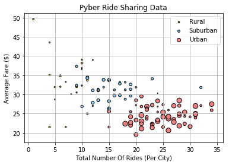
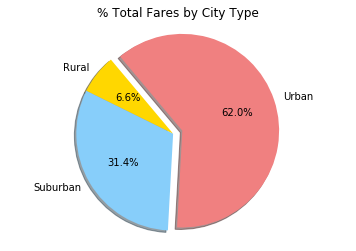
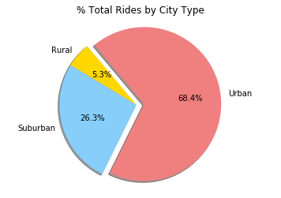
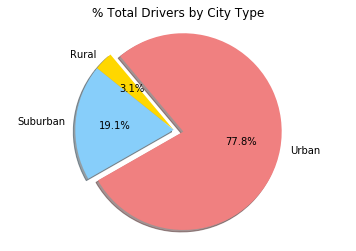

#Pyber Ride Sharing Analysis

* Trend 1: Though Uber is pulling out all the stops, enticing local drivers, offering discounts, and placing strategic
ads to their move into small-town . Looking at these charts I can conclude, “Uber's doesn’t seem to be working in rural 
area at least not as well as it does in urban areas.

* Trend 2: Uber has revolutionized the way people get around in big cities but it’s more of a complimentary service
in smaller towns and rural areas. Since there aren’t as many options to get around in smaller cities, 
I’ve observed looking at these charts that Uber passengers just aren’t as reliant on Uber as they are in bigger cities.

* Trend 3: When it comes to Uber drivers what I have observed is, the less urban an area is, the less demand for Uber.

```python
# Importing Dependencies
import matplotlib.pyplot as plt
import numpy as np
import pandas as pd
import os
from cycler import cycler
from sklearn.preprocessing import MinMaxScaler

# Create a reference path for CSV file desired
csvpath = os.path.join('city_data.csv')

# Read the first CSV into DataFrame
city_df = pd.read_csv(csvpath)

csvpath = os.path.join('ride_data.csv')
ride_df = pd.read_csv(csvpath)

#Merging the two dataframes
merge_ride_df =pd.merge(ride_df,city_df,on="city",how="outer")
```


```python
###### Bubble Plot of Ride Sharing Data #####

#Grouping the dataframe by type to perform the aggregate function on fare and ride_id
name_df=merge_ride_df.groupby(["city","type","driver_count"]).agg({'fare': pd.Series.mean, 'ride_id': pd.Series.count})

#renaming the columns
renamed_table_df = name_df.rename(columns={"ride_id":"Total Rides","fare":"Average Fare","type":"City_Type"})

#Reseting the index on grouped columns
name_bubble_index = renamed_table_df.reset_index()
```


```python
#Assigning x_values ,y_values, and driver_count and colors
x_values = name_bubble_index["Total Rides"]
y_values = name_bubble_index["Average Fare"]
labels = name_bubble_index["type"]
colors = ("Gold","LightSkyBlue","LightCoral")
driver_count = name_bubble_index["driver_count"]
#create a dataframe out of these
df = pd.DataFrame({'x': x_values, 'y': y_values, 'label': labels, 'driver_count': driver_count})
groups = df.groupby('label')

# Plot
fig, ax = plt.subplots()
my_colors = dict({"Rural": "Gold", "Suburban": "LightSkyBlue","Urban": "LightCoral"})

for name, group in groups:
    ax.scatter(group.x, group.y, marker='o', s = group.driver_count, color=my_colors[name], edgecolors='black', label=name)
    
#ms=group.normalized_driver_count.astype(int)
ax.legend()
ax.grid(True)
plt.title("Pyber Ride Sharing Data")
plt.xlabel("Total Number Of Rides (Per City)")
plt.ylabel("Average Fare ($)")
plt.show()
```





```python
###  Total Fares by City Type #####

#Grouping the dataframe by type to perform the aggregate function on fare
name_df=merge_ride_df.groupby(["type"]).agg({'fare': pd.Series.sum,})

#Reseting the index on grouped columns
name_df_index = name_df.reset_index()

#assigning values to sizes
sizes=name_df_index["fare"]

#assigning values to labesls
labels=name_df_index["type"]

#Assigning colors to the pie chart
colors=("Gold","LightSkyBlue","LightCoral")

# Creating the pie chart based upon the values above
plt.pie(sizes, labels=labels, explode=(0,0,0.1),autopct="{0:2.1f}%".format, shadow=True,startangle=130,colors=colors)

# Plotting chart with equal axes
plt.axis("equal")

#naming the plot with a title 
plt.title("% Total Fares by City Type")

# Prints out pie chart to the screen
plt.show()
```





```python
############Total Rides by City Type######
#Grouping the dataframe by type to perform the aggregate function on ride_id
name_df_rides=merge_ride_df.groupby(["type"]).agg({'ride_id': pd.Series.nunique,})

#Reseting the index on grouped columns
name_rides_index = name_df_rides.reset_index()

#assigning values to sizes
sizes=name_rides_index["ride_id"]

#assigning values to labels
labels=name_rides_index["type"]

#Assigning colors to the pie chart
colors=("Gold","LightSkyBlue","LightCoral")

# Creating the pie chart based upon the values above
plt.pie(sizes, labels=labels, explode=(0,0,0.1),autopct="{0:2.1f}%".format, shadow=True,startangle=130,colors=colors)

# Plotting chart with equal axes
plt.axis("equal")

#naming the plot with a title 
plt.title("% Total Rides by City Type")

# Prints out pie chart to the screen
plt.show()
```





```python
######### Total Drivers by City Type #####

#Grouping the dataframe by type to perform the aggregate function on driver_count
name_df_driver_count=city_df.groupby(["type"]).agg({'driver_count': pd.Series.sum,})

#Reseting the index on grouped columns
name_driver_count_index = name_df_driver_count.reset_index()

#assigning values to sizes
sizes=name_driver_count_index["driver_count"]

#assigning values to labels
labels=name_driver_count_index["type"]

#Assigning colors to the pie chart
colors=("Gold","LightSkyBlue","LightCoral")

# Creating the pie chart based upon the values above
plt.pie(sizes, labels=labels, explode=(0,0,0.1),autopct="{0:2.1f}%".format, shadow=True,startangle=130,colors=colors)

# Plotting chart with equal axes
plt.axis("equal")

#naming the plot with a title 
plt.title("% Total Drivers by City Type")

# Prints out pie chart to the screen
plt.show()
```




